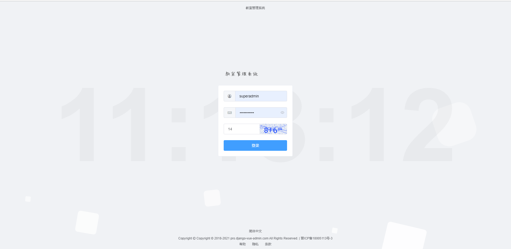
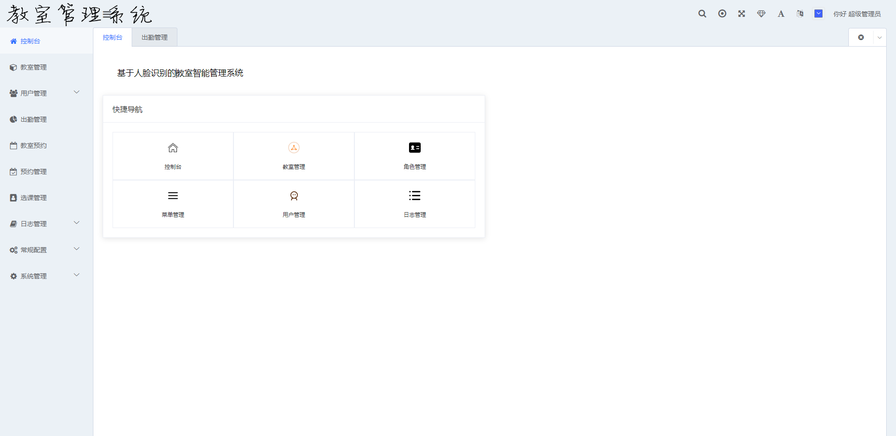
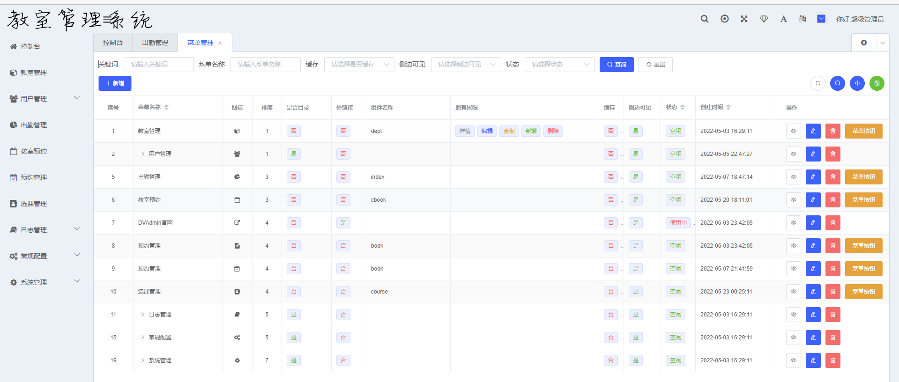

# 基于人脸识别的教室智能管理系统

本项目分为服务端和客户端两部分。服务端需要在服务器部署并对公网开放，客户端通过浏览器进行访问即可。

# 基于人脸识别的教室智能管理系统

* 🧑‍🤝‍🧑前端采用[D2Admin](https://github.com/d2-projects/d2-admin) 、[Vue](https://cn.vuejs.org/)、[ElementUI](https://element.eleme.cn/)。
* 👭后端采用 Python 语言 Django 框架以及强大的 [Django REST Framework](https://pypi.org/project/djangorestframework)。
* 👫权限认证使用[Django REST Framework SimpleJWT](https://pypi.org/project/djangorestframework-simplejwt)，支持多终端认证系统。

## 内置功能

1. 👨‍⚕️菜单管理：配置系统菜单，操作权限，按钮权限标识、后端接口权限等。
2. 🧑‍⚕️部门管理：配置系统组织机构（公司、部门、角色）。
3. 👩‍⚕️角色管理：角色菜单权限分配、数据权限分配、设置角色按部门进行数据范围权限划分。
4. 🧑‍🎓权限权限：授权角色的权限范围。
5. 👨‍🎓用户管理：用户是系统操作者，该功能主要完成系统用户配置。
6. 👬接口白名单：配置不需要进行权限校验的接口。
7. 🧑‍🔧字典管理：对系统中经常使用的一些较为固定的数据进行维护。
8. 🧑‍🔧地区管理：对省市县区域进行管理。
9. 📁附件管理：对平台上所有文件、图片等进行统一管理。
10. 🗓️操作日志：系统正常操作日志记录和查询；系统异常信息日志记录和查询。
11. 🔌[插件市场 ](https://bbs.django-vue-admin.com/plugMarket.html)：基于Django-Vue-Admin框架开发的应用和插件。

## 服务端

### 部署方法

详细内容查看django-vue-admin文件夹

## 客户端

登录界面

控制台界面

菜单管理

